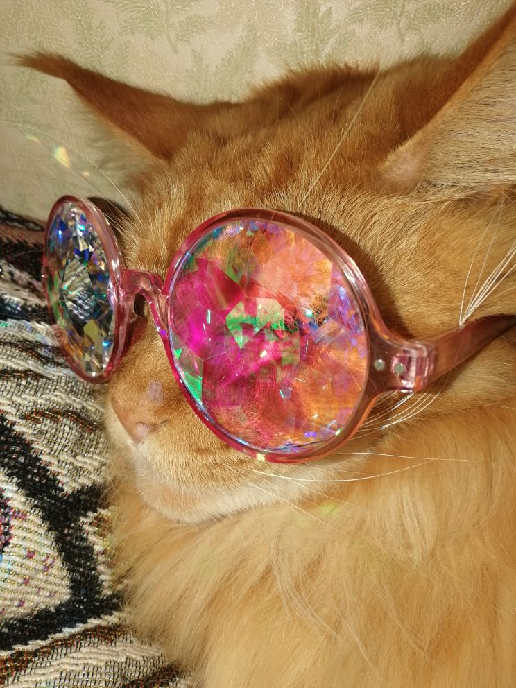

# ***Немного информации обо мне***
# ***Общая информация***
Меня зовут Маша, мне 18 лет. Я родилась и живу в Москве. Я учусь в Высшей школе экономики на направлении "Иностранные языки и межкультурная коммуникация".
# ***Моя семья***
У меня не очень большая семья: родители, сестра, бабушка и кот породы Мейн кун. Мы довольно дружны и всегда приходим на помощь друг другу. Хотя кот довольно ленив и мало что делает на благо семьи :)

# ***Мои хобби***
На самом деле, у меня не так много хобби, так как в последнее время у меня не так много времени на что-либо, кроме учёбы. Мне нравится вязать, слушать музыку, смотреть сериалы и играть в World of Warcraft. Пока что, единственное время, когда я могу посвятить себя этим хобби - каникулы.
# ***Учеба***
Как я написала ранее, я учусь в ВШЭ. Учеба в университете на порядок сложнее чем в обычной школе, но, тем не менее, она довольна интересна и увлекательна. Нам дают много новых и полезных знаний, которые возможно пригодятся в будущем. У нас очень много пар языка, истории Великобритании и литературы, а также некоторых косвенных дисциплин. Что касается Цифровой грамотности, эта дисциплина пока кажется довольно сложной, но, я надеюсь, что справлюсь с ней.
# ***Расписание***
Название урока|День недели|время урока
:---:|:---:|:---:
Цифровая грамотность (семинар и лекция)|Понедельник|13:40-18:00
Латинский язык|Вторник|10:30-11:50
Практика речи|Вторник\Четверг|12:10-15:00
Грамматика|Среда|9:00-11:50
Видео|Среда|13:40-15:00
НИС|Среда|15:00-16:30
Литература (семинар)|Среда|16:40-18:00\18:10-19:30
Фонетика|Четверг|10:30-11:50
Немецкий язык|Четверг\Пятница|13:40-16:30\13:40-15:00
МКН (семинар)|Пятница|12:10-13:30
Литература (лекция)|Пятница|15:10-16:30
МКН (лекция)|Пятница|16:40-18:00
[А это ссылка на мой вк!](https://vk.com/id231361389)
